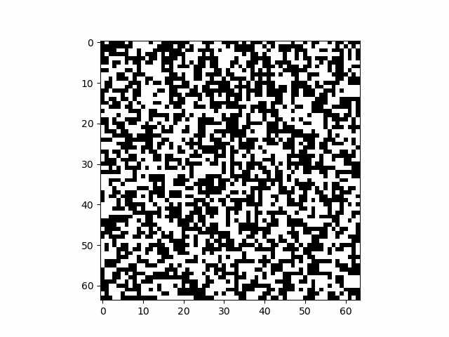
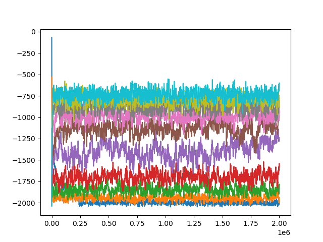
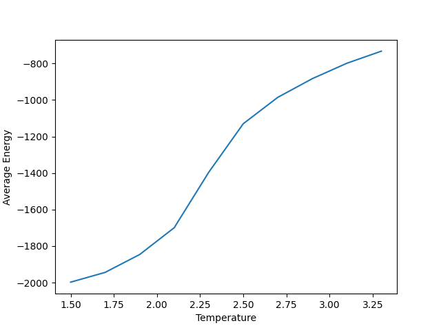
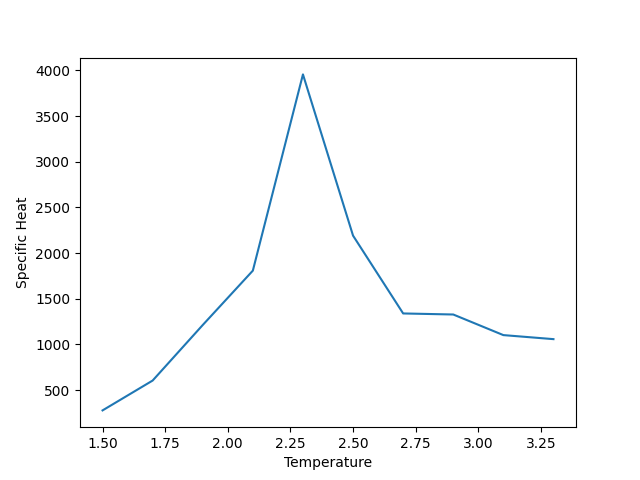

# Ising Model Monte Carlo Simulation and Analysis

## Overview

This project implements a Monte Carlo simulation of the two-dimensional Ising model and analyzes the resulting data using Python.

The simulation models a square lattice of interacting spins. Each spin is initialized randomly to either +1 or -1, and the system is evolved through repeated spin updates based on the energy associated with flipping individual spins.

The simulation uses a 32 × 32 lattice and evaluates the system over a range of temperatures. The resulting energy data is saved and then analyzed to examine how the average energy and specific heat vary with temperature.

## Project Structure

```text
01_ising_model_monte_carlo/
│
├── README.md
├── requirements.txt
│
├── ising_model.py
├── ising_analysis.py
│
├── data/
│   └── IsingModelData.csv
│
├── output/
│   ├── EnergyVsSteps.png
│   ├── AverageEnergyVsTemperature.png
│   └── SpecificHeatVsTemperature.png
│
└── images/
    └── ising_model.gif
```

## Simulation

The `ising_model.py` program performs the Montel Carlo simulation.

The simulation:

* Creates a 32 x 32 spin lattice
* Randomly initializes the spins
* Updates individual spins based on the energy change associated with a spin flip
* Uses periodic boundary conditions
* Calculates the total energy of the system
* Runs the simulation over multiple temperatures
* Records the resulting energy data

The temperatures used by the simulation range from 1.5 to 3.3.

# Simulation Animation 

The animation below shows the evolution of the spin lattice during the Monte Carlo simulation.



## Data Analysis

The `ising_analysis.py` program reads the simulation data and performs additional analysis.

The analysis calculates:

* Average energy
* Specific heat
* Energy as a function of simulation steps
* Average energy as a function of temperature
* Specific heat as a function of temperature

The analysis excludes the first 30% of the simulation data when calculating the average energy and specific heat.

## Results








## Python Libraries

The project uses:

* NumPy
* Matplotlib
* Pandas

See `requirements.txt` for the required Python packages.

## Running the Simulation

Clone or download this repository and navigate to the project directory.

Install the required Python packages:

```bash
pip install -r requirements.txt
```

Run the simulation with:

```bash
python ising_model.py
```

Run the analysis:

```Bash
python ising_analysis.py
```

The resulting figures are saved in the `output` directory

## Project Goals

The goal of this project was to simulate the behavior of the two-dimensional Ising model using Monte Carlo methods and analyze the resulting system energy as a function of temperature.

The project combines numerical simulation, statistical analysis, data processing, and scientific visualization in Python.
