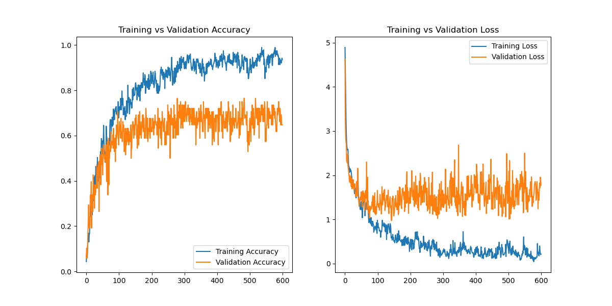

# Facial Recognition Neural Network

## Overview

This project implements a convolutional neural network (CNN) for facial image classification using Python and TensorFlow/Keras.

The network is trained to distinguish between different classes of facial images. The images are loaded from a local training dataset, resized to 128 × 128 pixels, and divided into training and validation datasets.

The project also uses image augmentation techniques to increase the variety of training examples and improve the model's ability to generalize.

> **Privacy Notice:** The original training images are not included in this repository because they contain photographs of the project participants.

## Project Structure

```
02_facial_recognition_neural_network/
│
├── README.md
├── requirements.txt
├── facial_training.py
├── .gitignore
│
├── TrainingData/
│   └── [private training images]
│
└── output/
    └── Network_Performance.png
```

The `TrainingData` directory is intentionally excluded from GitHub because it contains private photographs.

## Model

The neural network is a convolution neural network designed for image classification

The input images are:

* Resized to 128 x 128 pixels
* Processed as RGB images
* Divided into training and validation datasets

The model uses several convolutional and pooling layers followed by global average pooling and fully connected layers.

The final classification layer produces a prediction for each image class.

## Data Augmentation

The training data is augmented using several transformations, including:
* Horizontal flipping
* Rotation
* Contrast adjustment
* Translation

These transformations provide the network with additional variations of the training images during the learning process.

** Training

The dataset is automatically divided into:

* 80% training data
* 20% validation data

The model is trained using the Adam optimizer and sparse categorical cross-entropy loss.

Validation accuracy is monitored during training, and the best-performing model is saved during the training process.

The trained model is saved as:
`Model.keras`
The trained model is excluded from this repository through .gitignore.

## Results

The training program generates a graph showing the model's performance throughout training.



## Running the Project

# Install the required packages

From the directory, run:
```Bash
py -m pip install -r requirements.txt
```

# Prepare the training data
Because the original training images are private, they are not included in this repository. To run the program, place the appropriate images inside the `TrainingData` directory. The images should be organized into subdirectories representing the different image classes. Note, these should be 128 x 128, as previously mentioned.

For example:
```
TrainingData/
├── Class1/
│   ├── image001.jpg
│   ├── image002.jpg
│   └── ...
│
└── Class2/
    ├── image001.jpg
    ├── image002.jpg
    └── ...
```

# Train the neural network

Run:
``` Bash
py facial_training.py
```
The program will train the CNN and generate the network performance plot in the `output` directory.

## Technologies

This project uses:

* Python
* TensorFlow
* Keras
* NumPy
* Matplotlib

## Project Goals

The goal of this project was to develop a convolutional neural network capable of classifying facial images while exploring image preprocessing, data augmentation, neural network architecture, and model training.

This project demonstrates practical experience with:

* Convolutional neural networks
* Image classification
* Data augmentation
* Training and validation datasets
* Model evaluation
* Scientific visualization
* TensorFlow/Keras

